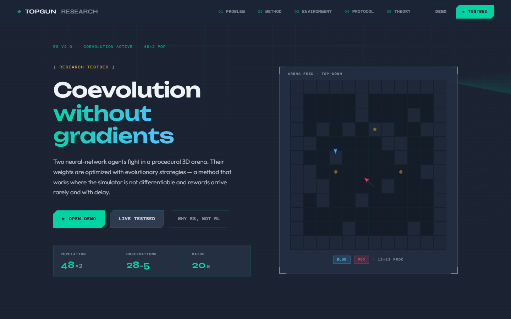
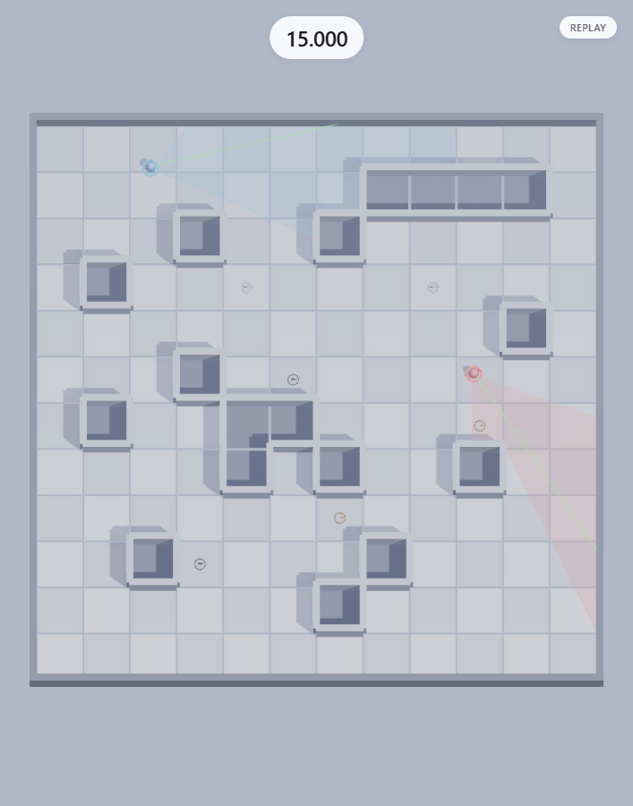
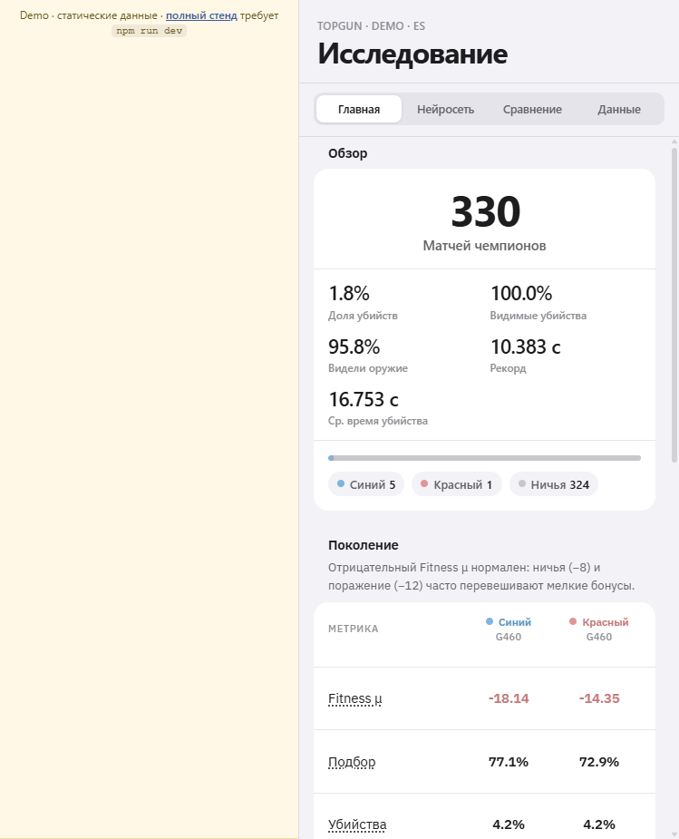

# TopGun Research

[](https://github.com/GavrilovEgorOf/topgun-research/actions/workflows/ci.yml)
[](https://gavrilovegorof.github.io/topgun-research/demo.html)
[](LICENSE)

A procedural 3D combat arena where two neural agents co-evolve via **Evolution Strategies** (no backprop). Includes a Three.js research dashboard, WebSocket live feed, replay system, worker-thread training, and reproducible headless simulation.

**Why it matters:** end-to-end ML research product — deterministic simulator, parallel fitness evaluation, real-time observability, static portfolio demo, CI, and architecture docs. Good fit for ML / fullstack / platform engineering portfolios.

## Demo

| Page | URL |
|------|-----|
| **Live demo** (static, no install) | https://gavrilovegorof.github.io/topgun-research/demo.html |
| Landing (local) | http://localhost:8080 |
| Research dashboard (local) | http://localhost:8080/research.html |
| Theory / report (local) | http://localhost:8080/theory_for_uni/ |



| 3D arena replay | Research panel |
|-----------------|----------------|
|  |  |

## Quick start

```bash
npm install
npm run dev      # UI + training server
npm test         # unit tests
npm run build    # production build
```

Separate processes:

```bash
npm run dev:ui   # Vite only (port 8080)
npm run train    # training server only (port 3001)
```

**Static demo only** (no Node training server):

```bash
npm run build
npm run preview  # open /demo.html
```

Refresh demo data after local training:

```bash
npm run export:demo   # writes public/demo/ from data/
```

## Stack

| Layer | Technologies |
|-------|--------------|
| Simulation | Pure JS, fixed 60 FPS timestep |
| ML | MLP (28→40→32→5), ES: elite + crossover + Gaussian mutation |
| Server | Node.js, worker_threads, WebSocket |
| UI | Vite, Three.js, Chart.js |

## Features

- **Parallel evaluation** of the population in worker threads with auto-tuned throughput
- **Live broadcast** of champion matches and WebSocket training status
- **Brain visualization** — observations, activations, weights (live and replay)
- **Checkpoint comparison** across generations on a fixed map
- **CSV/JSON export** for research reports
- **Deterministic simulation** — same seed + weights → same outcome
- **Static demo** — replay, charts, and checkpoint comparison without a backend

## Architecture

```
shared/      ← core: physics, observations, neural net, rewards
server/      ← training, API, persistence
src/         ← Three.js scene and research panel
public/demo/ ← static snapshot for portfolio / GitHub Pages
tests/       ← unit tests (node:test)
```

More details: [docs/ARCHITECTURE.md](docs/ARCHITECTURE.md)

## Training methodology

| Aspect | Implementation |
|--------|----------------|
| Map | Random seed per eval match; fixed `WORLD_SEED` for A/B checkpoints |
| Fitness | Kills, damage, exploration, anti-passivity; see the Data tab |
| UI statistics | Wins counted from **champion** matches only, not eval |
| Turn order | Even frames — blue first; odd frames — red |

## API (server `:3001`, proxied via Vite)

| Method | Path | Description |
|--------|------|-------------|
| GET | `/api/status` | Generation, statistics, history |
| GET | `/api/brains` | Champion weights |
| GET | `/api/replays` | List of best replays |
| POST | `/api/reset` | Reset training |
| GET | `/api/export/history.csv` | Per-generation dynamics CSV |
| WS | `/ws` | Live status + champion frames |

Mutating requests (`POST`/`PUT`/`DELETE`) are accepted from localhost only when `TOPGUN_HOST=127.0.0.1`.

## Data (`data/`)

Created on first run and **not committed**:

| File | Contents |
|------|----------|
| `state.json` | Populations and champions |
| `meta.json` | Session statistics, chart history |
| `replays.json` | Best matches with frames |
| `checkpoints/gen-*.json` | Snapshots every 25 generations |

For reports — export from the Data tab or `/api/export/*`. For demo — `npm run export:demo`.

## Environment variables

| Variable | Default | Purpose |
|----------|---------|---------|
| `TOPGUN_HOST` | `127.0.0.1` | Server address |
| `TOPGUN_PORT` | `3001` | Server port |
| `VITE_BASE` | `/` | Asset base path (for GitHub Pages: `/repo-name/`) |

## GitHub Pages

1. Push the repository to GitHub.
2. **Settings → Pages → Source:** GitHub Actions.
3. Workflow [`.github/workflows/pages.yml`](.github/workflows/pages.yml) builds and deploys `demo.html`.
4. URL: `https://gavrilovegorof.github.io/topgun-research/demo.html`

CI: [`.github/workflows/ci.yml`](.github/workflows/ci.yml) — tests and build on Node 20/22.

## Camera controls

- **LMB + drag** — pan
- **Mouse wheel** — zoom

## Repository structure

```
TopGun/
├── shared/           # Simulation and ML
├── server/           # Training engine, REST, WebSocket
├── src/              # Frontend
├── public/demo/      # Static demo bundle (in git)
├── tests/            # Automated tests
├── docs/             # Architecture + screenshots
├── theory_for_uni/   # Theory / defense notes
├── index.html        # Landing page
├── demo.html         # Static demo
└── research.html     # Full testbed
```

## License

[MIT](LICENSE)
